# Încărcarea Resurselor Educaționale Deschise

**Versiunea 1.5, Noiembrie, 2019**

Acest material descrie pașii pe care persoana care contribuie cu o resursă trebuie să-i parcurgă pentru a introduce o înregistrare viabilă. Formularul dedicat expune patru pași în succesiune, care la rândul lor, fiecare expun informații specifice.
Completarea pașilor pentru adăugarea unei Resurse Educaționale Deschise va genera în baza de date o fișă descriptivă, iar în directorul dedicat `repo` se va constitui câte un subdirector pentru fiecare resursă în parte în directorul fiecărui utilizator al platformei. Mai jos este un mic exemplu ilustrativ pentru structura unei resurse așa cum este structurată pe hard disk.

Pentru a fi mai simplu, din acest moment vom folosi în întreg documentul acronimul RED pentru Resurse Educaționale Deschise.

## Pasul 1 - Titlu și responsabilitate

Primul pas a fișei este dedicat introducerii titlului, descrierii și licenței pe care o poartă RED-ul.

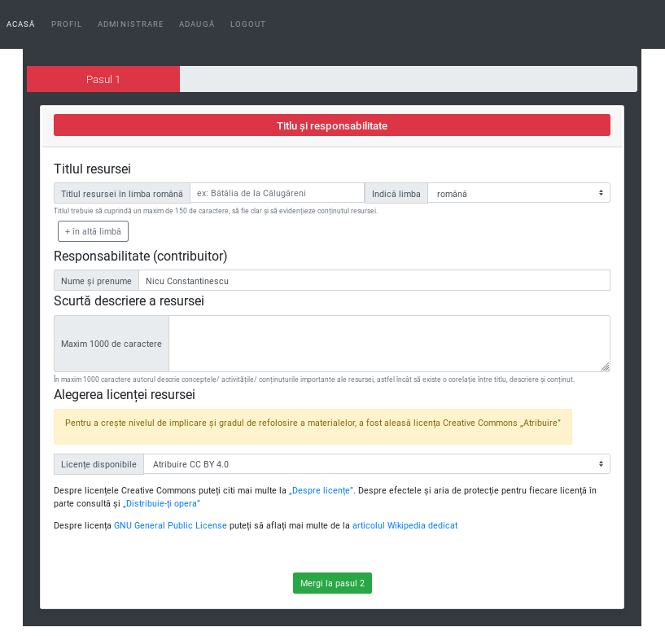

### Titlul resursei

Titlul resursei primește informația care va denumi resursa educațională și trebuie să fie o formulare concisă în limba română.

Software-ul prevede eventualitatea folosirii sale în grupuri ale vorbitorilor de alte limbi, care trăiesc în România sau care au devenit cetățeni români, dar sunt de altă naționalitate. În cazul acesta, formularul prevede posibilitatea de a introduce titlul în limba minorității urmată de selectarea limbii acesteia.

### Responsabilitate (contribuitor)

În secțiunea aceasta `Nume și prenume` este un câmp care va fi completat automat cu datele persoanei care s-a autentificat și care face contribuția. În baza adresei de email se va face generarea subdirectoarelor proprii fiecărui utilizator care contribuie cu resurse. Se va evita modificarea acestui câmp pentru că altfel, va conduce la un decuplaj a numelui cu adresa de email, ceea ce nu este de dorit.

Persoana care introduce RED-ul în sistem este considerat a fi contribuitorul acesteia. Un contribuitor poate fi autorul RED-ului, dar în cazul în care acesta este produsul a mai multor autori, unul dintre aceștia va fi desemnat să încarce resursa în sistem, fiind cel care *contribuie* RED-ul în sistem. În acest caz, contribuitorul poate fi considerat autor colectiv.

### O scurtă descriere a resursei

În maxim 1000 de caractere, contribuitorul trebuie să descrie conținutul RED-ului. Contribuitorul va introduce toate detaliile necesare realizării unei bune corelații între titlu, descriere și conținut.

Acest element este obligatoriu să fie completat. Este recomandabil să fie introduse două propoziții sau maxim o frază. Acest detaliu este foarte important pentru că dincolo de aspectele ce țin de natura funcțională, acesta este și textul care va apărea în prezentarea publică a resursei. 

### Alegerea licenței resursei

Un RED poartă încă din denumire atributul care permite tuturor celor interesați reutilizarea în scopuri didactice sau chiar pentru realizarea de lucrări derivate.
Pentru a crește nivelul de implicare și gradul de refolosire a materialelor, a fost aleasă suita de licențe Creative Commons. Prima opțiune, care este și cea selectată implicit este „Atribuire”, fiind cea mai deschisă din toate cele posibile. Despre licențele Creative Commons puteți citi mai multe la „[Despre licențe](https://creativecommons.org/licenses/?lang=ro)”. Despre efectele și aria de protecție pentru fiecare licență în parte consultă și „[Distribuie-ți opera](https://creativecommons.org/choose/?lang=ro)”

Pentru că este posibil ca unii dintre creatori să considere codul sursă a unui software ca fiind o Resursă Educațională Deschisă, am introdus și licența generică GNU - General Public License.
Despre licența [GNU General Public License](https://www.gnu.org/licenses/gpl-3.0.en.html) puteți să aflați mai multe de la [articolul Wikipedia dedicat](https://ro.wikipedia.org/wiki/Licen%C8%9Ba_Public%C4%83_General%C4%83_GNU).

## Pasul 2 - Încadrarea resursei

Pasul doi adaugă informație privind Aria curriculară, clasa sau clasele la care poate fi folosită resursa și competențele specifice expuse de fiecare disciplină.

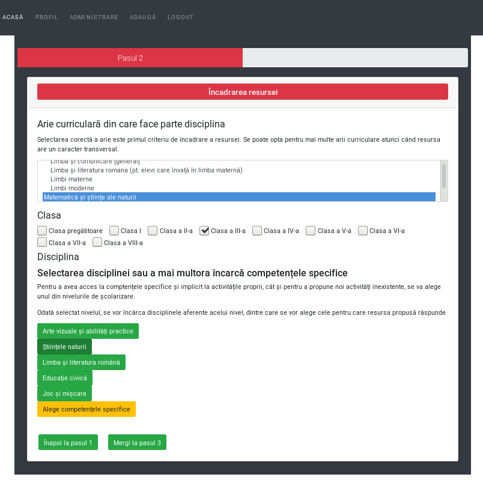

### Arie curriculară

Selectarea corectă a **Ariei curriculare** este primul criteriu de încadrare al resursei. Se poate opta pentru mai multe *arii curriculare* atunci când resursa are un caracter transversal.

### Clasa

Un RED poate fi conceput pentru a fi folosit la mai multe clase diferite. Acesta este și motivul pentru care a fost lăsată opțiunea de a alege mai multe clase. Atenție, selectarea claselor este în directă legătură cu apariția disciplinelor, care sunt expuse pentru încadrarea mai granulară. Bifarea unei clase are drept efect apariția disciplinelor acelor clase. Pentru acest material, am ales să nu încărcăm toate disciplinele. Dacă nu apar toate motivul este că folosim un set de date demonstrativ, redus ca dimensiuni.

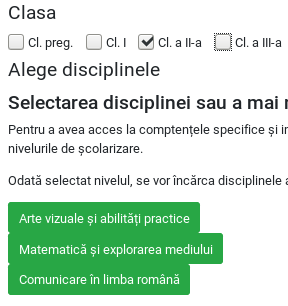

Bifarea mai multor clase, va adăuga setului existent disciplinele proprii.

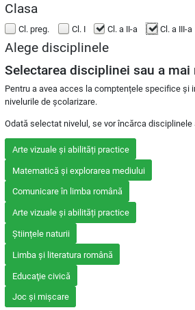

### Alege disciplinele

Selectarea disciplinei sau a mai multora încarcă competențele specifice. Pentru a avea acces la competențele specifice și implicit la activitățile proprii, cât și pentru a propune noi activități inexistente, se va alege una sau mai multe discipline.

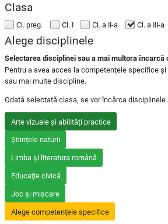

În acest moment, după ce am putut selecta disciplina sau disciplinele în cazul în care RED-ul răspunde mai multor discipline, apare opțiunea de a încărca competențele specifice așa cum apar acestea în Planul Național. Pentru fiecare dintre Competențele Specifice prezente, există posibilitatea de a consulta activitățile care sunt arondate.

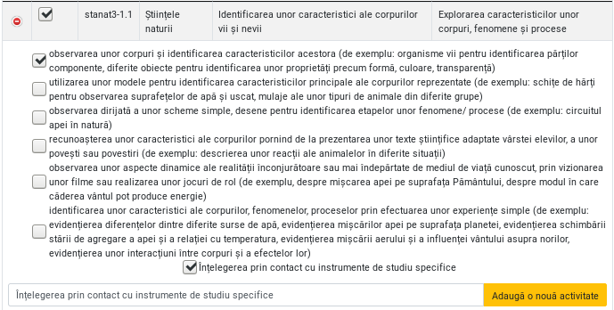

Pentru fiecare competență specifică, apăsând butonul verde, vei avea acces la cunoștințe, abilități, atitudini arondate fiecărei competențe specifice.
Acestea pot fi selectate, iar în cazul în care se dorește ceva ce nu există, este oferită posibilitatea de a introduce una nouă.

Activitățile noi introduse, vor completa setul celor deja existente.

## Pasul 3 - Validarea resursei prin specificitate

Acest pas permite o mai mare granularitate în ceea ce privește atributele și funcțiile / obiectivele pe care trebuie să le împlinească conținuturile Resursei Educaționale Deschise.

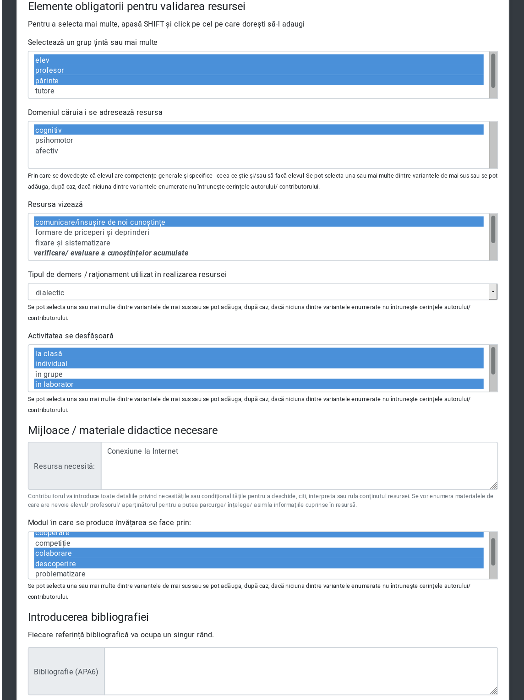

## Pasul 4 - Introducerea conținuturilor

Editorul permite încărcarea de fișiere tip document, text, referințe către materiale video, fragmente de cod active și fișiere de imagine în format `jpg` și `png`. Este permisă copierea și inserarea de text care conține hyperlinkuri.

Un posibil scenariu de completare poate implica introducerea unui fragment de text cu o imagine și un material video de pe Youtube. În acest sens, editorul oferit este foarte flexibil considerând fiecare intrare drept un bloc de conținut distinct.

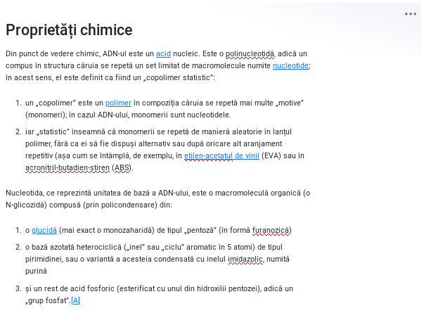

În cazul fișierelor de imagine este permisă încărcarea urmată de afișarea imaginii. Este preferabil ca una dintre imaginile încărcate, să fie cea mai reprezentativă pentru resursă. În cazul în care sunt mai multe imagini asociate conținutului, acestea pot fi încărcate fără probleme concomitent cu afișarea lor.

Încărcarea pentru imagine înseamnă copy/paste a unui link a cărui element final indică o imagine sau chiar încărcarea de pe hard disk a unei imagini. Pentru fiecare imagine, se va introduce un element descriptiv în zona `Caption` afișată dedesubt. Chiar dacă nu există nicio mențiune atașată imaginii, se va trece obligatoriu numele fișierului (este necesar pentru a asigura specificitatea resursei de imagine în contextul înregistrării).

Editorul permite încărcarea de fișiere word, pdf, etc.

Toate aceste fișiere încărcate vor sta împreună în același director dedicat al resursei pentru care se constituie înregistrarea.

După ce am încărcat în editor fragmentele necesare sau am încărcat un fișier care reprezintă resursa, se va proceda la alegerea imaginii, care va ilustra resursa la momentul afisării sale în zona publică. Putem să ne gândim la această imagine ca la o copertă.

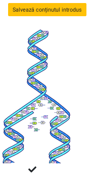

Din moment ce am făcut și acest mic pas, nu mai rămâne decât să completăm cuvintele cheie de care avem nevoie în plus față de cele generate prin completarea formularului.
Cuvintele cheie se completează delimitându-se cu virgulă, dar, atenție, fără spații între cuvintele cheie și virgule.

Odată parcus și acest ultim pas vom salva resursa și imediat vom fi trimiși în modul de vizualizare a sa.

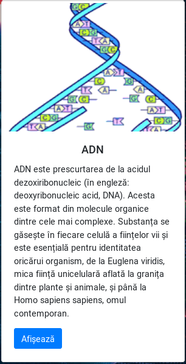

## Administrare

Unul din posibilele roluri pe care le poate juca un utilizator autentificat este cel de administrator. Administratorii pot face două operațiuni esențiale în economia existenței unui RED. 
RED-urile care nu sunt verificate, au un marcaj fin de culoare galbenă atunci când sunt accesate de un administrator. 

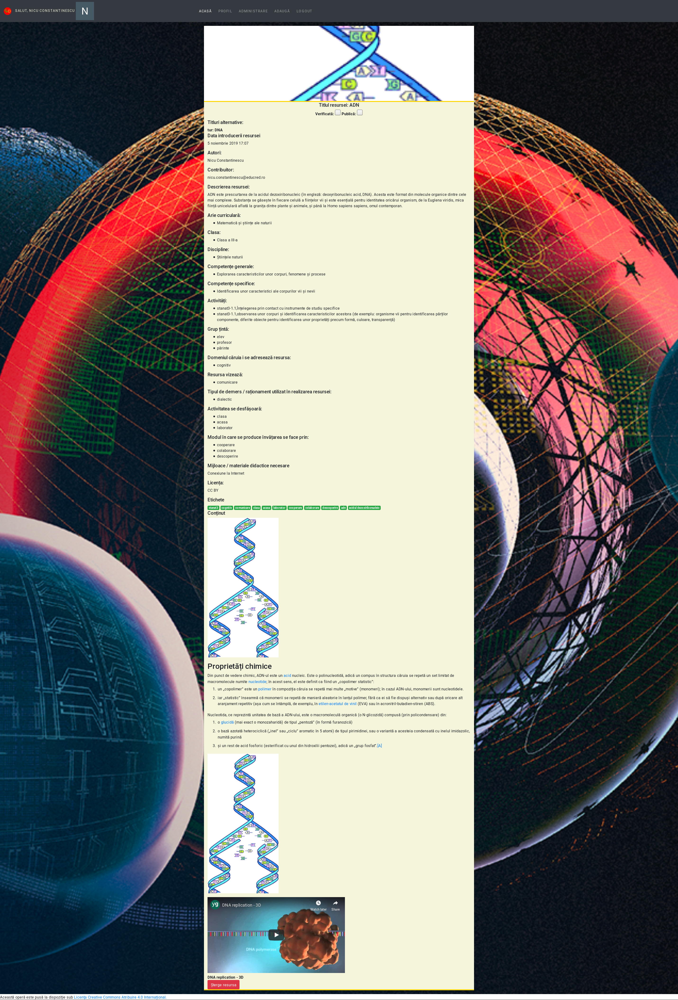

În momentul în care sunt validate, marcajul se transformă în verde indicând modificarea de stare.

Poate verifica și poate trimite RED-ul în zona publică.

